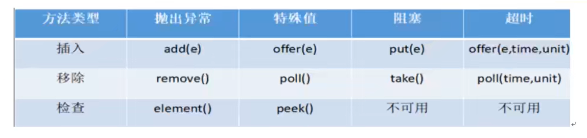

## 演示多线程锁的八个问题：

1、标准访问，先打印短信还是邮件
----sendSms
----sendEmail
2、停4秒在短信方法内，先打印短信还是邮件
----sendSms
----sendEmail
3、新增普通的hello方法，是先打印短信还是hello
----getHello
----sendSms
4、现在有两部手机，先打印短信还是邮件
----sendEmail
----sendSms
5、两个静态同步方法，1部手机，先打印短信还是邮件
----sendSms
----sendEmail
6、两个静态同步方法，2部手机，先打印短信还是邮件
----sendSms
----sendEmail
7、1个静态同步方法，1个普通同步方法，1部手机，先打印短信还是邮件
----sendEmail
----sendSms
8、1个静态同步方法，1个普通同步方法，2部手机，先打印短信还是邮件
----sendEmail
----sendSms

## 公平锁与非公平锁:
非公平锁：线程饿死、效率高
公平锁：阳光普照、效率相对低

## 可重入锁：
递归锁、synchronized（隐式）和Lock（显式）都是可重入锁

## 死锁：

1、什么是死锁：两个或两个以上进程或线程在执行过程中，因为竞争资源而造成一种互相等待的现象，如果没有外力干涉，他们无法再执行下去。

2、产生死锁原因：第一系统资源不足、第二进程运行推进顺序不合适、第三资源分配不当。

3、验证是否是死锁

3、死锁产生的四个条件：资源互斥、循环等待、不可抢夺，保持请求

## 读写锁：
一个资源可以被多个读线程访问，或者可以被一个写线程访问，但是不能同时存在读写线程，读写互斥，读读共享的
